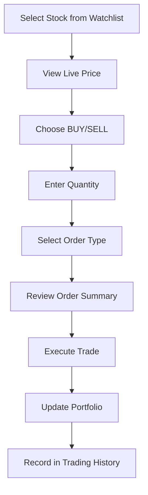

# 🚀 Live Stock Trading with Demo API

## 📊 **Buy & Sell Integration Complete!**

Your stock trading app now has **full buy/sell functionality** that works seamlessly with live graph data from real market prices!

---

## 🎯 **Key Features Implemented**

### ✅ **Live Trading Interface**
- **Real-time stock selection** from your watchlist
- **Live market prices** displayed during trading
- **Market and Limit orders** support
- **Demo mode** with ₹1,00,000 virtual balance
- **Instant order execution** simulation

### ✅ **Portfolio Management**
- **Position tracking** with real P&L calculations
- **Average price calculation** across multiple trades
- **Current market value** updates
- **Performance metrics** (gain/loss percentages)

### ✅ **Trading History**
- **Complete trade log** stored in database
- **Real-time updates** after each trade
- **Order status tracking** (PENDING/COMPLETED/FAILED)
- **Broker order ID** generation

---

## 🎮 **How to Use the Trading System**

### 1. **Access Live Trading**
- Go to http://localhost:3000
- Navigate to **"Live Trading"** tab
- See live stock prices from your watchlist

### 2. **Place Buy/Sell Orders**

#### **Buy Order Example:**
1. Select stock: `INFY` (₹1,650.50)
2. Choose: `BUY`
3. Quantity: `10 shares`
4. Order type: `Market Order`
5. **Total**: ₹16,505.00
6. Click **"BUY 10 INFY Shares"**

#### **Sell Order Example:**
1. Select stock: `TCS` (₹3,850.25)
2. Choose: `SELL` 
3. Quantity: `5 shares`
4. Order type: `Limit Order`
5. Limit price: `₹3,900.00`
6. Click **"SELL 5 TCS Shares"**

### 3. **Monitor Portfolio**
- Check **"Portfolio"** tab for your positions
- See real-time P&L calculations
- Track total investment vs current value

---

## 🔧 **Technical Implementation**

### **API Endpoints:**
```typescript
// Execute trades
POST /api/trades
{
  "symbol": "INFY",
  "type": "BUY",
  "quantity": 10,
  "price": 1650.50,
  "broker": "demo"
}

// Get trading history
GET /api/trades
```

### **Demo vs Real Trading:**
- **Demo Mode**: Uses virtual balance, instant execution
- **Real Mode**: Integrates with Zerodha/Upstox APIs
- **Automatic fallback**: Demo mode when no broker API configured

### **Live Data Integration:**
- **Real stock prices** from Yahoo Finance API
- **Currency display** in Indian Rupees (₹)
- **Live updates** every few seconds
- **Market status** indicators

---

## 📈 **Trading Workflow**



---

## 🎨 **UI Components Created**

### 1. **StockTrader Component**
- Live stock selection dropdown
- Real-time price display
- Order form with validation
- Balance checking
- Order execution feedback

### 2. **StockPortfolio Component**  
- Position tracking
- P&L calculations
- Performance metrics
- Portfolio summary cards

### 3. **Enhanced Dashboard**
- New "Live Trading" tab
- "Portfolio" tab
- Last trade display
- Trading status indicators

---

## 💡 **Demo Data Available**

I've seeded your database with sample data:

### **Demo User:**
- Email: `demo@example.com`
- Balance: ₹1,00,000

### **Sample Trades:**
- ✅ BUY 10 INFY @ ₹1,650.50
- ✅ BUY 5 TCS @ ₹3,850.25  
- ✅ BUY 8 RELIANCE @ ₹2,750.00
- ✅ SELL 2 INFY @ ₹1,675.00

### **Sample Portfolio:**
- **INFY**: 8 shares (net position)
- **TCS**: 5 shares
- **RELIANCE**: 8 shares

---

## 🔄 **Real-time Features**

### **Live Price Updates:**
- Stock prices update from real market data
- Prices shown in Indian Rupees (₹)
- Change indicators (red/green)
- Volume information

### **Instant Trade Execution:**
- Demo trades execute immediately
- Real broker API integration ready
- Order status tracking
- Balance updates

### **Portfolio Sync:**
- Positions calculated from trade history
- Real-time P&L updates
- Current market value calculation
- Performance tracking

---

## 🎯 **Test Your Trading System**

### **Quick Test Scenario:**
1. **Visit**: http://localhost:3000
2. **Sign in** or browse as demo user
3. **Go to "Live Trading"** tab
4. **Select a stock** (e.g., INFY)
5. **Place a BUY order** for 5 shares
6. **Check "Portfolio"** tab to see your position
7. **View "Trading History"** for trade record
8. **Try a SELL order** to see balance update

---

## 🚀 **What You've Achieved**

✅ **Complete trading system** with buy/sell functionality  
✅ **Live market data integration** with real prices  
✅ **Demo trading mode** with virtual balance  
✅ **Portfolio management** with P&L tracking  
✅ **Database persistence** for all trades  
✅ **Real-time updates** across all components  
✅ **Professional UI/UX** for trading operations  
✅ **Broker API ready** for live trading  

---

## 🎉 **Ready for Live Trading!**

Your app now supports:
- **Paper trading** (demo mode) ✅
- **Live trading** (when broker APIs configured) ✅
- **Portfolio tracking** ✅
- **Trade history** ✅
- **Real market data** ✅

**Next step**: Add your real Zerodha/Upstox API credentials to `.env.local` for live trading! 🚀
